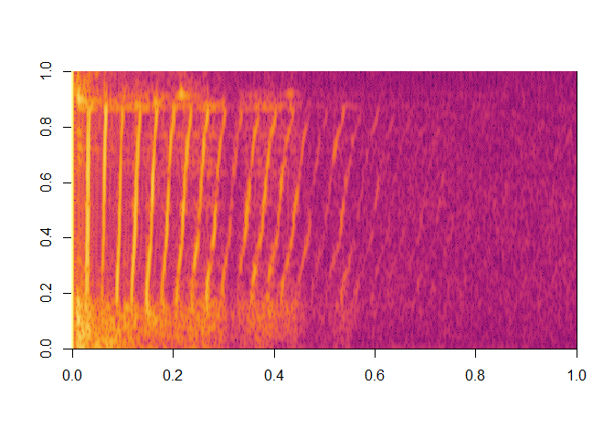

# ProTrackR


[ProTracker](https://en.wikipedia.org/wiki/Protracker) is music
sequencer software from the 1990s on the [Commodore
Amiga](https://en.wikipedia.org/wiki/Amiga) (see screenshot of version
2.3a on the right). This R package is designed to read, process and play
ProTracker module audio files.

## Installation

> Get CRAN version

``` r
install.packages("ProTrackR")
```

> Get development version from R-Universe

``` r
install.packages("ProTrackR", repos = c('https://pepijn-devries.r-universe.dev', 'https://cloud.r-project.org'))
```

## Usage

The package comes bundled with a tiny chiptune, which can easily be
played like so:

``` r
library(ProTrackR) |>
  suppressMessages()
data("mod.intro")

playMod(mod.intro, verbose = FALSE)
```

There are plethora of module files available on-line as well. Below you
can see how you can download such a file. It also show how you can
select an audio sample (number 25) from the module and calculate its
power spectrum:

``` r
elekfunk <- read.module("https://api.modarchive.org/downloads.php?moduleid=41529#elektric_funk.mod")

spec <- elekfunk |>
  PTSample(25) |>
  waveform() |>
  tuneR::powspec(wintime = 0.1, steptime = 0.001)

image(log10(spec), col = hcl.colors(100, palette = "Inferno"))
```



While we are at it, why not play it:

``` r
playMod(elekfunk, verbose = FALSE)
```

## Developmental status

It has been a decade since the initial release of this package. Since
it’s release a lot has changed in R and in my skill set. I still have
plans for this package, but this requires drastic changes. Therefore, I
will only apply minimal maintenance to this package. Meanwhile I will
work on a complete overhaul which will be released in due time as a new
package. This new package will:

- have the same or similar features as the current package.
- will implement modern R features and try to adhere to
  [tidyverse](https://www.tidyverse.org) principles.
- implement rendering procedures in C++ giving the package a speed
  boost.

But until then, please enjoy the current package as is.

## Further reading

For some further reading and inspiration please have a look at the
following blog articles:

- [Chiptunes in R
  (1)](https://r-coders-anonymous.blogspot.com/2015/09/protrackr-chiptunes-in-r-part-one.html)
- [Chiptunes in R
  (2)](https://r-coders-anonymous.blogspot.com/2015/11/protrackr-chiptunes-in-r-part-two.html)
- [Chiptunes in R
  (3)](https://r-coders-anonymous.blogspot.com/2016/11/protrackr-chiptunes-in-r-part-three.html)
